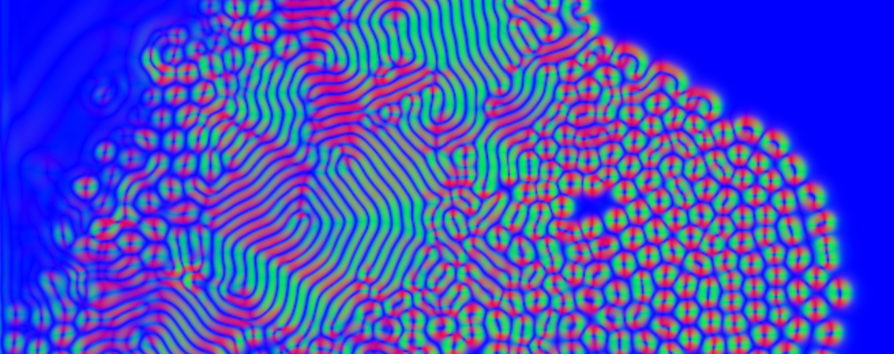

# rd_webgpu
reaction-diffusion using webgpu proof of concept



The goal is to create a webGPU implementation of reaction diffusion based on the following
numpy implementation.


https://github.com/benmaier/reaction-diffusion/blob/master/gray_scott.ipynb

Try the 2d reaction diffusion demo page at
<a href="https://flatironinstitute.github.io/rd_webgpu/rd2d.html">
https://flatironinstitute.github.io/rd_webgpu/rd2d.html.
</a>

The library structure is based on
https://andrewwalpole.com/blog/use-vite-for-javascript-libraries/


```bash
npm run build
npm run dev
```
